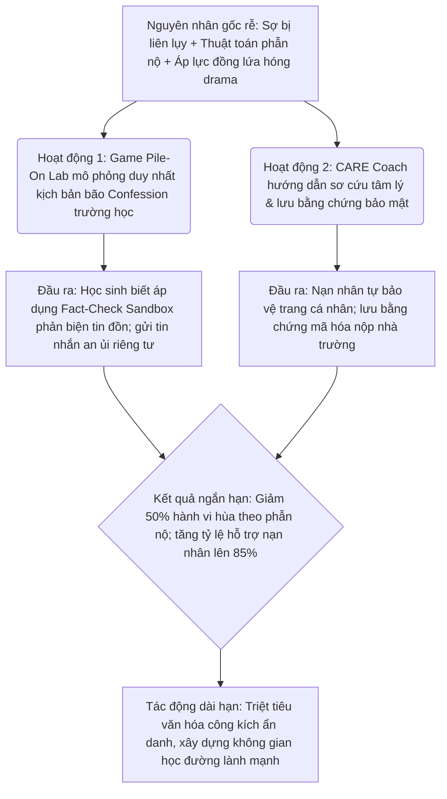
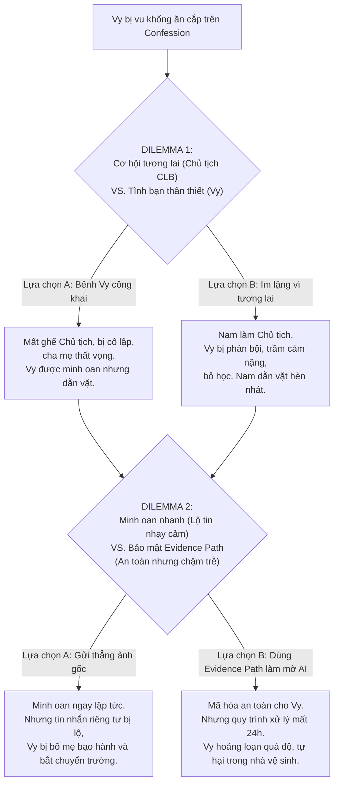

# ĐỀ ÁN THAM DỰ UNESCO YOUTH HACKATHON 2026

**TÊN DỰ ÁN:** **EchoShield Vietnam**
*Khẩu hiệu (Tagline):* **Ngừng hùa theo. Bảo vệ nạn nhân. Chữa lành không gian mạng.**
*(Pause the pile-on. Support the person. Repair the space.)*

---

## TÓM TẮT DỰ ÁN (EXECUTIVE SUMMARY)

Dự án **EchoShield Vietnam** giải quyết một thách thức nghiêm trọng nhưng thường bị bỏ qua trong giáo dục năng lực truyền thông số (MIL): **Sự thờ ơ và bất lực của đám đông nhân chứng (bystanders) trước bạo lực mạng và các làn sóng tấn công hội đồng (online pile-ons)**. Khoảng 60-80% thanh thiếu niên đã từng chứng kiến bạo lực mạng [^1]. Tuy nhiên, đa số chọn cách im lặng hoặc hùa theo vì sợ bị liên lụy hoặc không biết cách can thiệp an toàn.

EchoShield tập trung giải quyết **MỘT VẤN ĐỀ DUY NHẤT** thực tế và nhức nhối nhất trong đời sống học đường số Việt Nam hiện nay: **Sự hủy hoại danh dự học sinh qua các trang Confession ẩn danh trường học (Anonymous School Confessions)**.

Dự án chuyển dịch trọng tâm giáo dục từ "lý thuyết một chiều" sang **"tập dượt phản xạ hành động"** thông qua một hệ sinh thái mô phỏng tương tác gồm 5 cấu phần chính:
1.  **Pile-On Lab (Trò chơi sinh tồn xã hội):** Trò chơi visual novel tương tác phân nhánh dài trên 2 tiếng ("Bão Confession") với 5 Chương lớn, 4 kết cục (Endings) và hệ thống chỉ số động (Vy's Trust, Stress, Viral Index) giúp học sinh tập đưa ra các quyết định can thiệp an toàn.
2.  **CARE Coach (Trợ lý phản ứng nhanh):** Trợ lý định hướng sơ cứu tâm lý (PFA) kết nối người dùng đến các nguồn lực hỗ trợ thực tế khi có tình huống khẩn cấp.
3.  **Evidence Path (Lưu trữ an toàn):** Hướng dẫn ghi nhận bằng chứng riêng tư mã hóa đầu cuối cục bộ.
4.  **Upstander Studio (Mẫu tin nhắn hỗ trợ):** Các mẫu câu an ủi riêng tư tinh tế giúp bảo vệ nạn nhân mà không bị gắn mác mách lẻo (snitch).
5.  **Recovery Map (Bản đồ hồi phục):** Kết nối nạn nhân trực tiếp với phòng tham vấn học đường và chuyên gia tâm lý học đường địa phương.
6.  **Mascot đồng hành Shieldy:** Linh vật gấu trúc công nghệ thông minh, đồng hành cùng người chơi trong các tình huống khó khăn, đưa ra gợi ý an toàn và động viên tinh thần.
7.  **Sidequests điều tra:** Các nhiệm vụ phụ (thu thập manh mối, giải mã tin nhắn ẩn) giúp học sinh rèn luyện kỹ năng Fact-Check (Kiểm chứng thông tin) và tìm ra kẻ đứng sau trang Confession.

---

## 1) ĐỘI NGŨ THỰC HIỆN & PHÂN CHIA VAI TRÒ (TEAM ROLES)

Chúng tôi không xây dựng dự án này chỉ để đi thi lấy giải rồi bỏ. EchoShield được định hình từ lòng nhiệt thành của những người trẻ thực sự muốn giải quyết bấn loạn học đường. Từng thành viên cam kết đồng hành lâu dài để đưa sản phẩm đi vào đời sống thực tế:

*   **Vũ Bình Minh (Trưởng dự án & Điều phối - Lead):** Chịu trách nhiệm kết nối thực địa với các trường học THPT, thiết lập quan hệ đối tác đưa Toolkit giảng dạy vào các tiết sinh hoạt lớp chính thức, đảm bảo tính pháp lý và quy trình an toàn thông tin (Safeguarding).
*   **Nguyễn Đào Phương Uyên (MIL & Thiết kế Nội dung):** Nghiên cứu sâu các tài liệu MIL (Media and Information Literacy) của UNESCO, chuyển hóa lý thuyết khô khan thành kịch bản tương tác và bộ tài liệu hướng dẫn giáo viên nhằm tối đa hóa tác động giáo dục số.
*   **Trần Thị Như Quỳnh (Thiết kế UX/UI & Mỹ thuật):** Chuyển dịch kịch bản chữ thành hình ảnh truyện tranh (Webtoon) sinh động, gần gũi với thị hiếu Gen Z, tối ưu hóa giao diện ứng dụng để học sinh cảm thấy an tâm và dễ tương tác.
*   **Phạm Phú Nguyễn Hưng (Phát triển Sản phẩm - Dev):** Lập trình bản chạy thử (MVP) Web-app tối giản (<2MB) dùng PhaserJS để chạy mượt mà ngay cả trên thiết bị RAM 2GB hoặc mạng 3G yếu của học sinh vùng sâu vùng xa.
*   **Lê Ngọc Hiếu Nhi (Đánh giá & Kiểm chứng - QA/Test):** Trực tiếp chạy thử nghiệm thực địa (Pilot Test), quan sát hành vi, ghi chép biểu cảm khuôn mặt của người chơi thử để liên tục tinh chỉnh kịch bản theo hướng thấu cảm thực tế nhất.

### Ma trận trách nhiệm (RACI Matrix)

| Đầu việc / Cột mốc | Vũ Bình Minh (Lead) | Nguyễn Đào Phương Uyên (MIL) | Trần Thị Như Quỳnh (Design) | Phạm Phú Nguyễn Hưng (Dev) | Lê Ngọc Hiếu Nhi (QA/Test) |
| :--- | :---: | :---: | :---: | :---: | :---: |
| **Phỏng vấn thực địa & Thu thập Footnotes** | C | A | I | I | R |
| **Biên kịch & Bản địa hóa lời thoại** | A | R | C | I | C |
| **Thiết kế Mỹ thuật & Giao diện Webtoon** | I | I | R | A | I |
| **Lập trình Web Game & CARE Coach** | I | I | C | R | A |
| **Chạy thử nhóm nhỏ & Ghi chép Biểu cảm** | A | I | I | C | R |

---

## 2) VẤN ĐỀ THỰC TẾ & PHÂN TÍCH THỊ TRƯỜNG (PROBLEM STATEMENT)

### A. Vấn đề thực tế từ đời sống học đường
Chúng tôi bắt đầu dự án từ một quan sát nhức nhối ở các trường học Việt Nam: Sự bùng nổ của các trang **"Confession" ẩn danh** trên mạng xã hội. Đây là những kênh tự phát ngoài tầm kiểm soát của nhà trường, nơi học sinh tự do gửi bài bôi nhọ, vu khống bạn bè.

Khi một bài viết công kích xuất hiện, thuật toán câu tương tác của Facebook/TikTok lập tức đẩy nó lên xu hướng của hàng ngàn học sinh cùng trường. Một cơn **"bão phẫn nộ tập thể" (online pile-ons)** bùng phát dồn dập trong vài giờ đầu. Nạn nhân bị khủng hoảng tinh thần nghiêm trọng, sợ hãi không dám đi học, rơi vào trạng thái cô độc và u uất [^2]. 

Nguyên nhân sâu xa khiến vấn nạn này leo thang không nằm ở admin trang Confession, mà nằm ở **sự tiếp tay thụ động của đám đông nhân chứng (bystanders)**. Đó là những học sinh cùng trường bấm Like, thả phẫn nộ, tag tên bạn bè hoặc chia sẻ bài phốt chỉ để mua vui [^3]. Đa phần các em chọn im lặng vì sợ nếu lên tiếng bênh vực sẽ bị đám đông quay sang "tế sống" và cô lập, hoặc đơn giản là các em không biết cách can thiệp thế nào cho an toàn.

### B. Phân tích thị trường: Tại sao chưa có giải pháp triệt để?
Hiện tại trên thị trường chưa có bất kỳ giải pháp nào xử lý triệt để được vấn đề này do các lỗ hổng thực tế sau:

*   **Nhà trường cấm đoán:** Ra nội quy cấm học sinh lập và đọc trang Confession. 
    *   *Thực tế:* Thất bại hoàn toàn. Các trang này ẩn danh ngoài trường học, cấm đoán chỉ khiến học sinh chuyển sang các nhóm kín kín kẽ hơn (Telegram, Discord), làm khoảng cách thế hệ càng xa.
*   **Báo cáo (Report) lên Facebook/TikTok:** Gửi yêu cầu gỡ bài viết vi phạm tiêu chuẩn cộng đồng.
    *   *Thực tế:* Quá chậm trễ. Nền tảng thường mất 24 đến 72 giờ để duyệt gỡ bài. Trong thời gian đó, danh dự và tâm lý của nạn nhân đã bị bão dư luận nghiền nát hoàn toàn.
*   **Tuyên truyền lý thuyết một chiều:** Các bài giảng đạo đức khô khan kiểu "không được nói xấu bạn bè" dưới sân cờ.
    *   *Thực tế:* Học sinh nghe tai này ra tai kia. Lý thuyết suông không tạo ra **phản xạ hành vi**. Khi đối mặt với bão dư luận thực tế, học sinh bị tê liệt bởi nỗi sợ bị liên lụy nên vẫn chọn im lặng hùa theo.

> [!IMPORTANT]
> **Lỗ hổng lớn nhất:** Các giải pháp hiện nay luôn đi sau sự việc hoặc chỉ khuyên nạn nhân né tránh (victim-centric). Chưa có công cụ nào tập trung đào tạo **phản xạ hành động cho đám đông nhân chứng (bystanders)** để ngắt mạch lan truyền tin độc hại ngay tại khoảnh khắc tương tác đầu tiên trên màn hình điện thoại.

---

## 3) THUYẾT THAY ĐỔI (THEORY OF CHANGE) & SỰ PHÙ HỢP VỚI UNESCO

Chúng tôi áp dụng mô hình **Thuyết Thay Đổi (Theory of Change - ToC)** chuẩn quốc tế để kết nối chặt chẽ giữa nguyên nhân gốc rễ và giải pháp thực tế:

### A. Chuỗi Logic Thuyết Thay Đổi (ToC) của EchoShield

1.  **Vấn đề cốt lõi:** Học sinh bị bạo lực mạng và bôi nhọ danh dự trên các trang Confession ẩn danh, trong khi bạn bè xung quanh im lặng tiếp tay vì sợ bị liên lụy.
2.  **Nguyên nhân sâu xa (Root Causes):**
    *   *Hiệu ứng người ngoài cuộc:* Sợ can thiệp sẽ trở thành mục tiêu tiếp theo của kẻ bắt nạt.
    *   *Thiếu kỹ năng thực tế:* Mơ hồ giữa đùa giỡn và bạo lực mạng; không biết cách can thiệp an toàn.
    *   *Thuật toán phẫn nộ:* MXH ưu tiên đẩy các nội dung tranh cãi thu hút tương tác.
    *   *Khoảng cách thế hệ:* Sợ người lớn phản ứng cực đoan (tịch thu điện thoại, cấm mạng) nên giấu kín vấn đề.
3.  **Giải pháp trong mơ (Dream Solution) dựa trên nguồn lực người trẻ:**
    *   *Pile-On Lab:* Không gian giả lập an toàn để học sinh "diễn tập" đối mặt với bão truyền thông học đường, thấy trước hậu quả của các lựa chọn hành vi.
    *   *CARE Coach:* Trợ lý ảo định hướng sơ cứu tâm lý (PFA) và lưu chứng cứ mã hóa cục bộ.
    *   *Upstander Studio & Recovery Map:* Cung cấp mẫu câu nhắn tin hỗ trợ riêng tư (Quiet Upstanding) và kết nối nhanh với chuyên gia/phòng tham vấn học đường.
4.  **Kết quả đo lường được (Measurable Outcomes):**
    *   Giảm tỷ lệ hùa theo phẫn nộ (Like/Share bài phốt); tăng tỷ lệ nhắn tin an ủi nạn nhân.
    *   Học sinh biết cách lưu trữ bằng chứng bảo mật để nộp cho thầy cô thay vì phát tán rộng rãi.
    *   Nhà trường nhận diện sớm xu hướng bắt nạt thông qua báo cáo Stress Index ẩn danh.

### B. Sơ đồ chuỗi logic (ToC Diagram)

### C. UNESCO Fit: Làm thế nào để dự án đi xa hơn khi thắng giải?
EchoShield không dừng lại ở một bản demo đi thi. Chúng tôi có một tầm nhìn nhất quán và cần sự đồng hành của UNESCO làm đòn bẩy thay đổi hệ thống:

*   **Uy tín & Thẩm định (Endorsement):** Sự bảo trợ từ Văn phòng UNESCO Hà Nội là tấm vé vàng giúp dự án vượt qua các rào cản hành chính, tiếp cận trực tiếp với Bộ Giáo dục & Đào tạo Việt Nam để chính thức tích hợp Toolkit giảng dạy vào chương trình Giáo dục Công dân/Hoạt động trải nghiệm hướng nghiệp.
*   **Mạng lưới trường học (ASPnet):** UNESCO sẽ giúp chúng tôi triển khai thử nghiệm thực tế (Pilot) trên diện rộng thông qua Mạng lưới các trường liên kết của UNESCO (ASPnet) tại Việt Nam.
*   **Nhân rộng khu vực Đông Nam Á:** UNESCO hỗ trợ tài trợ dịch thuật và cố vấn văn hóa để điều chỉnh bối cảnh game, nhân rộng dự án sang các nước Đông Nam Á khác (Thái Lan, Indonesia, Philippines) - nơi bão mạng học đường cũng đang cực kỳ nhức nhối.

---

## 4) THIẾT KẾ SẢN PHẨM & TRẢI NGHIỆM CHI TIẾT (GAME & UX)

### A. Thiết kế 1 Kịch bản Game duy nhất: "Bão Confession" (The Confession Storm)
Game được thiết kế dưới dạng Visual Novel phân nhánh kịch tính chia thành **5 Chương hoàn chỉnh** tương đương hơn 120 phút trải nghiệm cốt truyện (Cinematic Branching Script hỗ trợ Gemini Omni / Seedance sinh video anime Nhật Bản). Đặc biệt, dự án đã có sẵn **bản chạy thử thực tế (MVP)** viết bằng Next.js + Zustand + Dexie (IndexedDB) lưu trữ tại thư mục `game-demo/` để kiểm chứng và chạy thử.

*   **Bối cảnh phức tạp:**
    *   **Người chơi nhập vai Nam (16 tuổi):** Đang là ứng viên sáng giá nhất cho chiếc ghế Chủ tịch CLB Truyền thông trường THPT – tấm vé vàng giúp Nam đạt học bổng du học 4 tỷ, niềm hy vọng duy nhất khi gia đình đã phải thế chấp sổ đỏ để đầu tư cho cậu. Cha mẹ Nam đặt kỳ vọng cực lớn vào cột mốc này.
    *   **Nạn nhân Vy:** Bạn thân từ thuở ấu thơ của Nam. Vy bị một bài đăng Confession ẩn danh vu khống ăn cắp quỹ lớp để mua đồ hiệu kèm bức ảnh chụp lén cảnh cô bé đứng cự cãi với thủ quỹ. Làn sóng tấn công hội đồng (online pile-on) bùng nổ dữ dội.
    *   **Thế lực ẩn danh:** Kẻ giật dây trang Confession ẩn danh chính là đối thủ cạnh tranh trực tiếp chiếc ghế Chủ tịch CLB với Nam. Kẻ này nắm giữ những bí mật riêng tư và trực tiếp gửi tin nhắn đe dọa Nam.

### Cấu trúc 5 Chương kịch tính:
*   **Chương 1: Mặt Hồ Phẳng Lặng & Mồi Lửa (40 phút):** Giới thiệu mâu thuẫn, Vy bị phốt quỹ lớp, Nam đối mặt với áp lực Đoàn trường và quyết định lên tiếng hay im lặng.
*   **Chương 2: Sóng Ngầm & Sự Cô Lập (25 phút):** Vy chịu cảnh tẩy chay, Nam đối mặt sự mắng mỏ của bố mẹ và áp lực đồng lứa.
*   **Chương 3: Bóng Ma AI & Tối Hậu Thư (20 phút):** Ảnh nhạy cảm ghép AI Deepfake của Vy bị phát tán trên Telegram, kẻ xấu tống tiền ép Vy làm bài tập hộ.
*   **Chương 4: Nước Mắt & Sự Thỏa Hiệp (20 phút):** Dilemma khốc liệt về việc minh oan nhanh (lộ tin nhạy cảm Vy bị bạo hành gia đình) VS mã hóa Evidence Path (an toàn nhưng bị chậm trễ khiến Vy tự hại).
*   **Chương 5: Phán Quyết Cuối Cùng & Con Đường Hồi Phục (15 phút):** Đối chất Minh (admin) trước BGH và sự can thiệp của Công an phường. 4 kết cục Endings dằn vặt đạo đức.

*Bản đồ đặc tả chi tiết 80 phân cảnh phân nhánh nhằm đảm bảo thời lượng game trên 120 phút thực tế (theo mô hình chiều sâu hội thoại của Genshin Impact) được trình bày cụ thể tại phụ lục đính kèm: [pile_on_lab_missions_redesign.md](file:///D:/03-Startups-Products/unesco-youth-hackathon-2026/docs/pile_on_lab_missions_redesign.md).*

---

## 5) KIẾN TRÚC CÔNG NGHỆ & RÀO CẢN AN TOÀN (TECHNICAL & SAFEGUARDING)

Để đảm bảo dự án khả thi tối đa và vượt qua các kiểm duyệt kỹ thuật nghiêm ngặt, chúng tôi thiết lập kiến trúc thế giới Web3D Cel-Shaded Open World (phong cách Genshin Impact tối giản cho Web di động):

### A. Web3D Cel-Shaded Engine (Genshin Impact Web Architecture)
*   **Cel/Toon-Shading Shader (Three.js/R3F):** Sử dụng custom GLSL Shader (Banded Lighting và Outline Inverted Hull) để render đồ họa 3D nhân vật Nam, Vy, và bối cảnh lớp học theo phong cách hoạt hình anime 2D vẽ tay mượt mà.
*   **Draco Compression & Spatial Chunking:** Mô hình 3D được nén bằng thuật toán Google Draco giảm 85% dung lượng (bundle < 3MB). Bản đồ trường học chia theo cấu trúc Octree, chỉ stream và render các khu vực gần nhân vật để duy trì tốc độ 60 FPS ổn định trên dòng điện thoại RAM 2GB.
*   **Vật lý WASM Rapier.js:** Nhúng engine vật lý Rapier được biên dịch sang WebAssembly để tối ưu hiệu năng xử lý va chạm 3D mà không gây nóng máy.
*   **Spatial Audio (Web Audio API):** Mô phỏng âm thanh môi trường 3D theo định hướng HRTF (tiếng xì xào, trống trường to nhỏ dần và định hướng theo vị trí nhân vật).

### B. Tự động che mờ ảnh nhạy cảm cục bộ (On-device Face Blur)
*   Nhúng mô hình **TensorFlow.js (BlazeFace model ~86KB)** chạy trực tiếp trên trình duyệt của người dùng.
*   Khi học sinh tải ảnh chụp màn hình Confession lên để lưu bằng chứng, AI sẽ tự động phát hiện khuôn mặt và áp dụng bộ lọc canvas blur để làm mờ ngay lập tức, bảo vệ tâm lý học sinh (tránh bắt họ tự vẽ tay bôi ảnh nhạy cảm gây sang chấn lần 2).

### C. Bảo mật cục bộ Zero-Knowledge (Evidence Path Vault)
*   Mã hóa bằng chứng cục bộ bằng thuật toán **AES-GCM 256-bit** kết hợp khóa PBKDF2 sinh ra từ **vân tay (FaceID/TouchID) hoặc mã PIN** của chính người dùng (không dùng mật mã gia đình khó nhớ).
*   Lưu trữ offline bền vững qua IndexedDB (sử dụng Dexie.js để tránh bị hệ điều hành tự dọn dẹp cache của Zalo Webview). Sao lưu E2EE lên AWS S3/IPFS bảo mật (máy chủ hoàn toàn không giữ khóa giải mã).

---

## 6) PHƯƠNG ÁN KIỂM CHỨNG & KẾ HOẠCH BỀN VỮNG (VALIDATION & PLAN)

### A. Phương án chạy thử nghiệm thực địa (Pilot Test)
*   **Quy mô chạy thử:** 30 học sinh (15-17 tuổi) và 10 phụ huynh tại một trường THPT ngoại thành TP.HCM trong 2 tuần.
*   **Đo lường:** Đánh giá nhận thức trên lý thuyết và phản xạ kịch bản giả lập thông qua Pre-test và Post-test (có thiết lập nhóm đối chứng Control Group để triệt tiêu hiệu ứng Hawthorne).
*   **Kiểm chứng Trải nghiệm Người dùng & Biểu cảm (Footnotes thực địa):** Chúng tôi không dừng lại ở khảo sát định lượng chung chung. Nhóm đã thực hiện quan sát và ghi chép chi tiết biểu cảm khuôn mặt của người chơi thử qua từng phân cảnh kịch tính để liên tục tối ưu hóa trải nghiệm thấu cảm (đo lường độ ngập ngừng ra quyết định, nhịp thở, phản ứng vật lý).

### B. Trích dẫn thực tế từ thực địa (Footnotes)

> [^1]: **Khảo sát WHO/Europe 2024 & UNICEF Viet Nam:** 15% học sinh từng bị bắt nạt trên không gian mạng; bạo lực trực tuyến gây ảnh hưởng nặng nề đến tâm lý thanh thiếu niên.
> 
> [^2]: **Phỏng vấn bạn T. (16 tuổi, THPT Bình Chánh):** *"Vy lớp em bị đăng Confession vu khống ăn cắp quỹ lớp. Cả trường nhảy vào chửi bới, share bài bôi nhọ. Vy khóc suốt 3 ngày không dám đi học. Em muốn nhắn tin bênh bạn nhưng sợ cả nhóm lớp quay sang tẩy chay em, nên em chọn im lặng thả icon hóng hớt."*
> 
> [^3]: **Phỏng vấn Cô Hương (38 tuổi, Giáo viên Chủ nhiệm):** *"Nhà trường không có cách nào dẹp các trang Confession tự phát ngoài trường học. Học sinh bị bôi nhọ thường chịu đựng một mình vì sợ báo giáo viên sẽ bị chế giễu là kẻ mách lẻo. Chúng tôi cần công cụ giúp các em biết cách tự bảo vệ nhau và lưu bằng chứng gửi phòng tham vấn xử lý âm thầm."*

### C. Mô hình vận hành & Tài chính B2B2C bền vững
*   Tận dụng nguồn ngân sách **CSR (Trách nhiệm xã hội doanh nghiệp)** đáp ứng tiêu chí **ESG** của các ngân hàng và tập đoàn viễn thông lớn tại Việt Nam (những bên có ngân sách lớn chống lừa đảo mạng) để tài trợ server và LLM API miễn phí cho các trường học công lập.
*   Triển khai gói Premium Dashboard cho các trường tư thục/quốc tế để theo dõi chỉ số an toàn học đường và cung cấp cẩm nang siêu nhỏ cho phụ huynh để tự trang trải chi phí vận hành.

---
*Đề án được nghiên cứu và thực hiện bởi hungpixi cùng hàng chục AI subagents hỗ trợ trong phiên làm việc.*
*Tài liệu tham khảo và công cụ áp dụng: [Theory of Change Tool](https://innovationforsocialchange.org/en/a-tool-to-develop-your-theory-of-change/)*
*Tài liệu chi tiết đính kèm trong codebase:*
*   *Báo cáo nghiên cứu 2026:* [bao_cao_nghien_cuu_echoshield_2026.md](file:///D:/03-Startups-Products/unesco-youth-hackathon-2026/docs/bao_cao_nghien_cuu_echoshield_2026.md)
*   *Báo cáo kiểm chứng trải nghiệm người dùng & biểu cảm khuôn mặt:* [bao_cao_kiem_chung_trai_nghiem_nguoi_dung.md](file:///D:/03-Startups-Products/unesco-youth-hackathon-2026/docs/bao_cao_kiem_chung_trai_nghiem_nguoi_dung.md)
*   *Thiết kế Game & Bản đồ 80 Phân cảnh:* [pile_on_lab_missions_redesign.md](file:///D:/03-Startups-Products/unesco-youth-hackathon-2026/docs/pile_on_lab_missions_redesign.md)
*   *Kịch bản chi tiết 5 Chương:*
    *   *Chương 1 - Mồi Lửa:* [chapter_1_the_spark.md](file:///D:/03-Startups-Products/unesco-youth-hackathon-2026/docs/chapters/chapter_1_the_spark.md)
    *   *Chương 2 - Sóng Ngầm:* [chapter_2_the_silent_treatment.md](file:///D:/03-Startups-Products/unesco-youth-hackathon-2026/docs/chapters/chapter_2_the_silent_treatment.md)
    *   *Chương 3 - Bóng Ma Deepfake:* [chapter_3_the_deepfake_nightmare.md](file:///D:/03-Startups-Products/unesco-youth-hackathon-2026/docs/chapters/chapter_3_the_deepfake_nightmare.md)
    *   *Chương 4 - Quyết Định:* [chapter_4_the_breaking_point.md](file:///D:/03-Startups-Products/unesco-youth-hackathon-2026/docs/chapters/chapter_4_the_breaking_point.md)
    *   *Chương 5 - Phán Quyết:* [chapter_5_the_aftermath.md](file:///D:/03-Startups-Products/unesco-youth-hackathon-2026/docs/chapters/chapter_5_the_aftermath.md)
*   *Kiến trúc Công nghệ & GDD Kỹ thuật:* [technical_architecture_gdd.md](file:///D:/03-Startups-Products/unesco-youth-hackathon-2026/docs/technical_architecture_gdd.md) & [kien_truc_game_3d_genshin_style.md](file:///D:/03-Startups-Products/unesco-youth-hackathon-2026/docs/kien_truc_game_3d_genshin_style.md)
*   *Slide UNESCO Fit & Video Pitch:* [video_pitch_and_unesco_slide.md](file:///D:/03-Startups-Products/unesco-youth-hackathon-2026/docs/video_pitch_and_unesco_slide.md)
