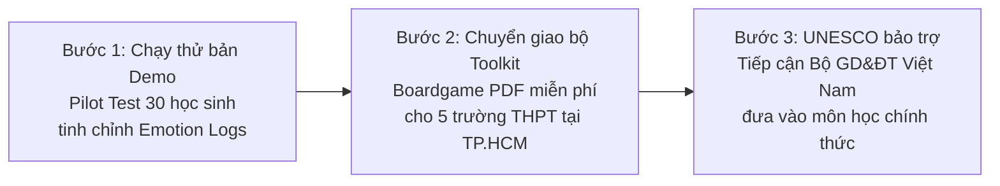

# CHIẾN LƯỢC & CẢM HỨNG PHÁT TRIỂN SẢN PHẨM: TRIẾT LÝ "TIỆM PHỞ ANH HAI" TINH GỌN & THỰC TẾ
*Dự án: EchoShield Vietnam*
*Phương châm: Tập trung tối đa vào sản phẩm cốt lõi kịch tính, bản địa hóa cực hạn và vận hành tinh gọn.*

---

## I. TRIẾT LÝ "TIỆM PHỞ ANH HAI" & 3 NGUYÊN LÝ CỐT LÕI

Sự thành công của tựa game indie Việt Nam xuất sắc **"Tiệm phở của Anh Hai"** (*Brother Hai's Pho Restaurant*) đem lại một bài học kinh điển về cách tạo ra một sản phẩm gây sốt (viral) toàn quốc với chi phí sản xuất tối thiểu nhờ vào 3 nguyên lý thiết kế:

1.  **Vỏ bọc đánh lừa (The Safe Facade) & Cú Twist u tối (The Dark Underbelly):** Trò chơi bắt đầu bằng một giao diện bình dị, vô hại. Nhưng càng đi sâu, thế giới u tối đầy kịch tính, bí ẩn kinh dị và tâm lý giật gân mới bắt đầu lộ diện qua từng chi tiết nhỏ, tạo sức hút lôi cuốn khó cưỡng.
2.  **Bản địa hóa cực hạn (Hyper-local):** Từng viên gạch bông cổ, chiếc bàn nhựa xanh, bảng hiệu bám bụi cổng trường được tái hiện chân thực. Sự quen thuộc đời thường này tạo ra sợi dây kết nối cảm xúc cực mạnh với người chơi bản địa.
3.  **Tập trung tối thượng vào trải nghiệm độc bản (Core Focus):** Không dàn trải tài nguyên cho thế giới mở rộng lớn hay đồ họa 3D siêu khủng. Game chỉ tập trung vào đúng một bối cảnh tiệm phở nhưng khai thác cực sâu kịch bản và bầu không khí tâm lý.

Áp dụng vào **EchoShield Vietnam**, chúng ta loại bỏ hoàn toàn các ý tưởng ứng dụng cồng kềnh, phức tạp để tập trung phát triển một sản phẩm game duy nhất có chiều sâu cốt truyện và tính chân thực bản địa tối đa.

---

## II. ĐẶC TẢ THIẾT KẾ GAMEPLAY: "BÃO CONFESSION"

Không đi theo lối mòn của các game giáo dục MIL (Media and Information Literacy) khô khan, EchoShield khoác lên mình lớp vỏ mô phỏng đời sống học đường vui nhộn, từ từ dẫn dắt người chơi vào một tấn bi kịch tâm lý nghẹt thở.

### 1. Vỏ bọc "Chủ tịch CLB" (Chương 1)
*   **Lối chơi:** Người chơi nhập vai Nam, quản lý trang tin Confession của CLB Truyền thông trường. Nhiệm vụ ban đầu rất nhẹ nhàng: duyệt các tin nhắn tỏ tình dễ thương, tìm đồ thất lạc, canh giờ đăng bài câu tương tác để tích điểm danh vọng nộp hồ sơ học bổng du học.
*   **Không khí:** Nhạc nền lo-fi học đường du dương, tiếng trống trường rộn rã, không gian lớp học tràn ngập ánh nắng.

### 2. Cú Twist "Bẫy ngầm Confession" (Chương 2 trở đi)
*   **Điểm bẻ gãy:** Xuất hiện một confession nặc danh vu khống Vy (bạn học của Nam) ăn cắp quỹ lớp. Nhạc lo-fi biến mất, thay bằng những tiếng thì thầm rầm rì xung quanh lớp học.
*   **Chuyển đổi lối chơi:** Từ duyệt bài thông thường, game chuyển thành **cuộc điều tra trinh thám học đường**. Người chơi phải điều khiển Nam lén lút tìm kiếm chứng cứ trong phòng máy, lục tủ đồ, giải mã IP và đối mặt với kẻ tống tiền nặc danh.
*   **Cảnh báo đỏ:** Mascot Shieldy (tinh linh AI đồng hành) bắt đầu phát cảnh báo khẩn cấp khi chỉ số Stress của Nam và Vy chạm mức nguy hiểm.

### 3. Bản địa hóa cực hạn (Vietnamese Authenticity)
Để bất kỳ học sinh Việt Nam nào khi chơi cũng phải thốt lên *"Đúng là trường mình rồi!"*:
*   **Hình ảnh thân thuộc:** Bảng đen bám bụi phấn, chiếc quạt trần ba cánh cọc cạch cũ kỹ, dãy bàn gỗ khắc chi chít chữ vẽ bậy, căng tin vỉa hè với trà đá và nước ngọt xá xị Chương Dương.
*   **Giao diện thực tế:** Bong bóng thoại chat mô phỏng chuẩn 100% Messenger, Zalo và các nhóm chat lớp "không có giáo viên".
*   **Slang Gen Z đời thực:** Sử dụng ngôn ngữ tự nhiên như *"bóc phốt", "nằm vùng", "tế sống", "cào bàn phím", "mõm"*. Các bình luận toxic dưới bài viết được mô phỏng trần trụi để người chơi cảm nhận rõ sức sát thương của bạo lực mạng.

---

## III. GIÁ TRỊ GIÁO DỤC UNESCO & MÔ HÌNH VẬN HÀNH THỰC TẾ

### 1. Giáo dục ẩn (Learning by Stealth) & Trách nhiệm đám đông
Người chơi không bị nhồi nhét lý thuyết suông. Họ phải tự đưa ra quyết định: *Có bấm chia sẻ bài phốt không? Có hùa theo chửi rủa trong phần bình luận không?* 
Mỗi quyết định tò mò vô hại của đám đông nhân chứng (bystanders) sẽ đẩy thanh Stress của Vy lên cao. Trò chơi trừng phạt sự thờ ơ bằng các kết cục (Endings) ám ảnh tâm lý nặng nề, buộc người chơi tự rút ra bài học sâu sắc về lòng thấu cảm số.

### 2. "Xe phở nhượng quyền" (Phân phối siêu nhẹ & Dễ tiếp cận)
Để trò chơi lan tỏa nhanh chóng mà không gặp rào cản kỹ thuật:
*   **Web-App siêu nhẹ (Bundle size < 2MB):** Sử dụng PhaserJS tối giản. Học sinh chỉ cần quét mã QR tại bảng tin trường hoặc click link trên Facebook/Zalo là chơi được ngay trên mọi điện thoại giá rẻ hoặc mạng 3G yếu, không cần tải app từ cửa hàng ứng dụng.
*   **Toolkit Boardgame PDF (Print & Play):** Đóng gói toàn bộ kịch bản rẽ nhánh thành file thẻ bài PDF miễn phí. Giáo viên chỉ cần tải về, in ra giấy A4 là có thể tổ chức chơi trực tiếp trong các tiết sinh hoạt lớp không cần internet.

### 3. "Tài trợ tô phở" (Mô hình tài chính B2B2C bền vững)
*   **Tài trợ CSR (Corporate Social Responsibility):** Các ngân hàng và tập đoàn công nghệ lớn (đối tượng chịu thiệt hại nhiều nhất từ deepfake và lừa đảo mạng) sẽ tài trợ dự án dưới dạng chương trình an toàn số CSR. Logo của họ xuất hiện tinh tế trên các màn hình công cụ để bảo trợ thương hiệu, giúp EchoShield có ngân sách duy trì server miễn phí cho học sinh.
*   **Premium Dashboard cho trường học:** Cung cấp báo cáo phân tích Stress Index (chỉ số căng thẳng ẩn danh) cho các trường THPT tư thục/quốc tế để nhận diện sớm các xu hướng bắt nạt học đường.

---

## IV. KẾ HOẠCH TRIỂN KHAI SPRINT 3 BƯỚC (ROADMAP)

1.  **Bước 1: Nấu thử nước dùng (Tháng 1 - 2):** Chạy thử nghiệm bản game PhaserJS với nhóm 30 học sinh để đánh giá phản ứng cảm xúc của người chơi, qua đó tinh chỉnh lời thoại kịch bản thực tế hơn.
2.  **Bước 2: Mở quán phở đầu tiên (Tháng 3 - 6):** Đóng gói bộ boardgame PDF (Print & Play). Chuyển giao và hướng dẫn 5 trường THPT chạy thử nghiệm trong các giờ sinh hoạt lớp.
3.  **Bước 3: Nhượng quyền quy mô lớn (Tháng 7 - 12):** Tận dụng sự bảo trợ danh tiếng từ UNESCO Hà Nội để trình đề án lên Bộ Giáo dục & Đào tạo Việt Nam, hướng tới tích hợp bộ toolkit này vào môn Giáo dục Công dân/Hoạt động trải nghiệm hướng nghiệp THPT trên toàn quốc.
