# BÁO CÁO THUYẾT THAY ĐỔI (THEORY OF CHANGE) - DỰ ÁN ECHOSHIELD VIETNAM

Dự án **EchoShield Vietnam** hướng đến mục tiêu chuyển đổi những nhân chứng im lặng (silent witnesses) trên không gian mạng thành những người bảo vệ tích cực và an toàn (safe upstanders), từ đó ngăn chặn tình trạng bắt nạt hội đồng (online pile-ons) và bạo lực mạng trong giới trẻ Việt Nam từ 15–24 tuổi.

Để hiện thực hóa tầm nhìn này, báo cáo áp dụng mô hình **Thuyết Thay Đổi (Theory of Change - ToC)** nhằm thiết lập một lộ trình logic chặt chẽ từ nguyên nhân cốt lõi đến tác động xã hội dài hạn.

---

## 1. Sơ đồ Logic Mermaid - Thuyết Thay Đổi (ToC) của EchoShield

```mermaid
graph TD
    %% Nguyên nhân cốt lõi (Root Causes)
    subgraph Root_Causes ["1. NGUYÊN NHÂN CỐT LÕI (Sự thờ ơ của nhân chứng)"]
        RC1["Hiệu ứng người ngoài cuộc<br>(Sợ liên lụy, sợ bị trả thù)"]
        RC2["Thiếu kỹ năng thực tế<br>(Mơ hồ giữa đùa giỡn & bạo lực; không biết cách can thiệp an toàn)"]
        RC3["Động lực tương tác MXH<br>(Thuật toán & nút Like/Share vô tình cổ xúy bắt nạt)"]
        RC4["Nỗi sợ người lớn phản ứng quá đà<br>(Sợ bị thu thiết bị, bị đổ lỗi)"]
    end

    %% Đầu vào & Hoạt động (Inputs & Activities)
    subgraph Activities ["2. ĐẦU VÀO & HOẠT ĐỘNG"]
        A1["Co-design kịch bản thực tế cùng giới trẻ & chuyên gia"]
        A2["Xây dựng nền tảng web mô phỏng Pile-On Lab & CARE Coach"]
        A3["Tổ chức các buổi tập huấn 60-75 phút tại trường học/CLB"]
        A4["Đào tạo mạng lưới thủ lĩnh trẻ 'Echo Allies'"]
    end

    %% Giải pháp trong mơ (Dream Solution)
    subgraph Dream_Solution ["3. GIẢI PHÁP TRONG MƠ (EchoShield Ecosystem)"]
        DS1["Pile-On Lab:<br>Giả lập tình huống MXH thực tế"]
        DS2["CARE Coach:<br>Trợ lý ảo hướng dẫn theo khung CARE"]
        DS3["Evidence Path:<br>Lưu chứng cứ an toàn tại thiết bị cục bộ"]
        DS4["Upstander Studio & Recovery Map:<br>Mẫu câu ứng xử & kết nối nguồn trợ giúp"]
        DS5["Facilitator Toolkit:<br>Bộ công cụ offline cho giáo viên & học sinh"]
    end

    %% Kết quả ngắn hạn (Short-term Outcomes)
    subgraph Short_Term ["4. KẾT QUẢ NGẮN HẠN (Nhận thức cá nhân)"]
        ST1["Nhận diện hành vi bạo lực mạng và phân biệt được với bất đồng thông thường"]
        ST2["Nắm vững khung ứng phó CARE và các từ ngữ de-escalate (giảm leo thang)"]
        ST3["Biết cách tìm kiếm và kết nối nguồn hỗ trợ an toàn"]
    end

    %% Kết quả trung hạn (Medium-term Outcomes)
    subgraph Medium_Term ["5. KẾT QUẢ TRUNG HẠN (Hành vi nhóm)"]
        MT1["Học sinh giảm tương tác tiêu cực (Like/Share/Comment) trong các vụ pile-on"]
        MT2["Tăng cường hành động hỗ trợ nạn nhân một cách riêng tư (private outreach)"]
        MT3["Bảo vệ chứng cứ an toàn thay vì phát tán rộng rãi"]
        MT4["Cộng đồng học đường/CLB xây dựng các nội quy điều phối số tự quản"]
    end

    %% Tác động dài hạn (Long-term Impact)
    subgraph Long_Term ["6. TÁC ĐỘNG DÀI HẠN (Chuẩn mực văn hóa)"]
        LT1["Kiến tạo môi trường số an toàn, đồng cảm và văn minh cho giới trẻ Việt Nam"]
        LT2["Tích hợp kỹ năng ứng phó bạo lực mạng vào chương trình Giáo dục Công dân số chính quy"]
        LT3["Xây dựng hệ thống hỗ trợ tâm lý học đường kết hợp công nghệ bền vững"]
    end

    %% Rủi ro và Biện pháp giảm thiểu
    subgraph Risks_Mitigation ["7. RỦI RO LẠM DỤNG & GIẢM THIỂU"]
        R1["Rủi ro 1: Lạm dụng hệ thống để vu khống/tố cáo nặc danh"]
        M1["Giảm thiểu 1: Không có tính năng tố cáo công khai hoặc lưu dữ liệu đám mây; bằng chứng lưu cục bộ"]
        
        R2["Rủi ro 2: CARE Coach bị nhầm là tư vấn tâm lý lâm sàng"]
        M2["Giảm thiểu 2: Tuyên bố miễn trừ trách nhiệm rõ ràng; không chẩn đoán tự động; chuyển hướng đến hotline thực tế"]
        
        R3["Rủi ro 3: Can thiệp công khai gây tác dụng ngược/trả thù"]
        M3["Giảm thiểu 3: Đào tạo hành động hỗ trợ riêng tư (quiet support) và tôn trọng quyền tự quyết của nạn nhân"]
    end

    %% Mối liên kết logic
    RC1 & RC2 & RC3 & RC4 --> A1 & A2
    A1 & A2 & A3 & A4 --> DS1 & DS2 & DS3 & DS4 & DS5
    DS1 & DS2 & DS3 & DS4 & DS5 --> ST1 & ST2 & ST3
    ST1 & ST2 & ST3 --> MT1 & MT2 & MT3 & MT4
    MT1 & MT2 & MT3 & MT4 --> LT1 & LT2 & LT3

    %% Liên kết rủi ro
    DS2 -.-> R2 --> M2
    DS3 -.-> R1 --> M1
    DS4 -.-> R3 --> M3
```

---

## 2. Phân tích Chi tiết Thuyết Thay Đổi (Theory of Change)

### 2.1. Nguyên nhân cốt lõi của sự thờ ơ của nhân chứng (Root Causes)
Sự im lặng của nhân chứng không đơn thuần đến từ sự vô cảm, mà xuất phát từ các rào cản tâm lý xã hội và kỹ năng sâu sắc:
*   **Hiệu ứng người ngoài cuộc (Bystander Paralysis):** Người trẻ lo sợ rằng việc can thiệp công khai sẽ biến họ thành mục tiêu tiếp theo của kẻ bắt nạt, dẫn đến bị cô lập hoặc bị trả thù (retaliation).
*   **Thiếu kỹ năng thực tế:** Rất nhiều học sinh không phân biệt được đâu là một lời đùa cợt vô hại và đâu là hành vi bắt nạt lặp đi lặp lại. Đồng thời, họ không biết can thiệp thế nào để không làm đám đông kích động thêm.
*   **Chuẩn mực xã hội mơ hồ (Ambiguous social norms):** Các vụ bắt nạt trực tuyến thường bị coi nhẹ như một dạng "drama" hay giải trí trực tuyến. Áp lực đồng lứa (conformity) khiến học sinh dễ bấm "Like" hoặc thả biểu tượng cảm xúc cười cợt theo đám đông.
*   **Động lực tương tác (Attention incentives):** Thuật toán mạng xã hội ưu tiên hiển thị các bài viết tranh cãi gay gắt, tạo ra phần thưởng ảo cho hành vi công kích.
*   **Sợ hãi phản ứng của người lớn:** Học sinh có xu hướng giấu kín các vụ bạo lực mạng vì lo ngại cha mẹ/thầy cô sẽ tịch thu điện thoại, cấm sử dụng mạng hoặc đưa ra những hình phạt thiếu thấu hiểu.

### 2.2. "Giải pháp trong mơ" (Dream Solution)
"Giải pháp trong mơ" của EchoShield không cố gắng giám sát hay tự động trừng phạt kẻ bắt nạt. Thay vào đó, nó thiết lập một **môi trường diễn tập an toàn** giúp nhân chứng tự tin hành động theo khung **CARE**:

1.  **Pile-On Lab (Phòng giả lập bắt nạt hội đồng):** Trải nghiệm game hóa (gamified) mô phỏng các giao diện quen thuộc của giới trẻ Việt Nam (Zalo, Facebook, TikTok). Học sinh được chọn các quyết định khác nhau và nhìn thấy trực tiếp hậu quả/kết quả của hành động đó lên tâm lý nạn nhân và bầu không khí của nhóm.
2.  **CARE Coach (Trợ lý định hướng hành vi):** Một AI/chatbot bị giới hạn nghiêm ngặt, đóng vai trò là người đặt câu hỏi gợi mở để người dùng tự đánh giá mức độ nghiêm trọng, hướng dẫn các bước lưu bằng chứng, soạn câu từ hòa giải và gợi ý các kênh liên hệ phù hợp.
3.  **Evidence Path (Lộ trình lưu trữ bảo mật):** Giải quyết vấn đề thu thập chứng cứ. Thay vì chụp ảnh màn hình rồi chia sẻ lung tung gây phản tác dụng, Evidence Path hướng dẫn học sinh tạo nhật ký sự cố chi tiết và lưu trữ file trực tiếp trên bộ nhớ thiết bị cá nhân (Local Device), không tải lên bất kỳ máy chủ đám mây nào.
4.  **Upstander Studio & Recovery Map:**
    *   **Upstander Studio:** Cung cấp sẵn các mẫu tin nhắn hòa giải, ứng xử văn minh, giúp người dùng can thiệp mà không tạo thêm xung đột mới.
    *   **Recovery Map:** Bản đồ số hóa các nguồn lực hỗ trợ thực tế của từng trường học (phòng tư vấn tâm lý, giáo viên phụ trách) và các đường dây nóng quốc gia về bảo vệ trẻ em (Tổng đài 111).

---

## 3. Các mốc tác động và KPIs đo lường được

| Khung thời gian | Mục tiêu tác động chính | KPIs đo lường chính (Chỉ số cho giai đoạn Pilot) |
| :--- | :--- | :--- |
| **Ngắn hạn** *(Trong & ngay sau buổi tập huấn)* | **Thay đổi Nhận thức cá nhân:** - Người dùng phân biệt được bất đồng quan điểm và bạo lực mạng. - Thuộc lòng và hiểu cách áp dụng 4 bước của khung CARE. | - **500 học sinh** tham gia trực tiếp các buổi tập huấn pilot. - Điểm kiểm tra nhận thức (Pre- vs Post-test) tăng trung bình **+25%**. - Ít nhất **70%** học sinh áp dụng đúng cả 4 bước CARE trong tình huống giả định của Pile-On Lab. |
| **Trung hạn** *(2–4 tuần sau tập huấn)* | **Thay đổi Hành vi nhóm:** - Học sinh giảm tương tác (like, share) bài viết công kích. - Tăng cường nhắn tin hỗ trợ riêng tư (private outreach) cho nạn nhân. - Lưu trữ chứng cứ bảo mật, không phát tán thêm. | - **80%** học sinh được khảo sát lựa chọn hành động hỗ trợ nạn nhân ít nhất một lần thay vì im lặng. - **75%** học sinh thực hành lưu trữ bằng chứng riêng tư thông qua Evidence Path khi phát hiện sự việc. - **05 câu lạc bộ/trường học** tự nguyện tái sử dụng hoặc tích hợp bộ công cụ này vào hoạt động sinh hoạt định kỳ. |
| **Dài hạn** *(6–12 tháng & sau đó)* | **Thay đổi Chuẩn mực văn hóa:** - Xây dựng văn hóa số đồng cảm, an toàn trong học đường. - Chuyển đổi chính sách quản trị nhóm số của học sinh (đặt quy tắc rõ ràng, có người điều phối an toàn). | - Tiếp cận trực tuyến đạt **12,000 lượt** qua chiến dịch truyền thông "Do Not Feed the Pile-On". - **08 trường học/cộng đồng** chính thức đưa EchoShield vào chương trình định hướng đầu năm học hoặc tuần lễ công dân số. - Mạng lưới **Echo Allies** (Thủ lĩnh đồng hành) hoạt động tự chủ dưới sự giám sát an toàn của giáo viên tâm lý học đường. |

---

## 4. Phân tích Rủi ro lạm dụng hệ thống và Biện pháp giảm thiểu

Khi triển khai một ứng dụng liên quan đến bạo lực mạng, nguy cơ hệ thống bị lợi dụng hoặc gây tác dụng ngược là rất lớn. Dưới đây là các rủi ro cụ thể và giải pháp thiết kế của EchoShield:

### Rủi ro 1: Hệ thống bị lạm dụng để vu khống hoặc tố cáo nặc danh vô căn cứ
*   *Mô tả:* Học sinh có thể lợi dụng công cụ để tạo ra các báo cáo giả mạo, gán nhãn bạn bè là "kẻ bắt nạt" nhằm mục đích bôi nhọ hoặc trả thù cá nhân.
*   *Biện pháp giảm thiểu:*
    1.  **Không lưu trữ đám mây:** Công cụ **Evidence Path** của EchoShield chỉ là một bộ khung biểu mẫu hướng dẫn nằm trên thiết bị cá nhân của học sinh. EchoShield **không có nút "Gửi báo cáo lên hệ thống" (No Cloud Database)**, không lưu trữ hồ sơ của bất kỳ cá nhân nào trên máy chủ để tránh rò rỉ dữ liệu.
    2.  **Không có danh sách đen (No Perpetrator List):** Hệ thống không xếp hạng, gán nhãn hay công khai danh tính của bất cứ ai bị nghi ngờ là thủ phạm.
    3.  **Tôn trọng quy trình thực tế:** Việc xử lý các vụ việc bạo lực hoàn toàn dựa trên sự đồng hành của giáo viên/phụ huynh dựa trên chứng cứ thực tế lưu trên máy học sinh, không qua sự can thiệp tự động của ứng dụng.

### Rủi ro 2: Trợ lý ảo CARE Coach bị nhầm lẫn là dịch vụ tư vấn tâm lý chuyên nghiệp
*   *Mô tả:* Học sinh đang gặp khủng hoảng tâm lý nghiêm trọng (hoặc có ý định tự tử) tìm đến CARE Coach để tâm sự và kỳ vọng nhận được lời khuyên y tế/tâm lý trị liệu, dẫn đến nguy cơ chậm trễ trong việc cứu hộ khẩn cấp.
*   *Biện pháp giảm thiểu:*
    1.  **Giới hạn phản hồi nghiêm ngặt:** CARE Coach được thiết lập theo dạng cây quyết định (decision tree) hoặc mô hình ngôn ngữ bị kiểm soát chặt chẽ. Trợ lý này **không được phép đưa ra lời khuyên tâm lý lâm sàng hoặc chẩn đoán trạng thái tinh thần**.
    2.  **Tuyên bố từ chối trách nhiệm (Disclaimer) liên tục:** Hiển thị rõ ràng thông điệp: *"Tôi là trợ lý học tập số, tôi không phải là chuyên gia tâm lý hay bác sĩ."*
    3.  **Escalation khẩn cấp:** Khi phát hiện các từ khóa liên quan đến tự hại, đe dọa bạo lực thể xác hoặc bóc lột tình dục, hệ thống sẽ lập tức dừng phản hồi thông thường và hiển thị nổi bật số điện thoại cứu hộ khẩn cấp (Tổng đài 111, các đường dây nóng tâm lý) kèm hướng dẫn tìm kiếm người lớn đáng tin cậy.

### Rủi ro 3: Nhân chứng can thiệp công khai dẫn đến bị phản công (Retaliation) hoặc tạo ra một làn sóng bắt nạt mới
*   *Mô tả:* Học sinh sau khi học xong mong muốn bảo vệ bạn bè nên đã nhảy vào tranh cãi tay đôi, công kích ngược lại kẻ bắt nạt trên phần bình luận công khai, khiến sự việc leo thang thành một vụ bạo lực mạng quy mô lớn hơn.
*   *Biện pháp giảm thiểu:*
    1.  **Ưu tiên hành động "âm thầm" (Quiet/Private Upstanding):** Chương trình đào tạo của EchoShield luôn nhấn mạnh rằng hành động hỗ trợ hiệu quả nhất là **nhắn tin riêng** để hỏi han nạn nhân và **báo cáo ẩn danh** lên quản trị viên hoặc nền tảng mạng xã hội.
    2.  **Tôn trọng quyền tự quyết của nạn nhân (Target Agency):** Học sinh được dạy phải hỏi ý kiến của nạn nhân trước khi có bất kỳ hành động can thiệp công khai nào (trừ trường hợp đe dọa tính mạng khẩn cấp). Điều này giúp nạn nhân không cảm thấy bị tước đoạt quyền kiểm soát câu chuyện của chính mình.
    3.  **Mẫu câu de-escalate chuẩn hóa:** Trong **Upstander Studio**, các mẫu câu được thiết kế theo hướng trung lập, tập trung vào việc kêu gọi dừng lan truyền thông tin, không dùng từ ngữ mang tính đổ lỗi hay khích bác đối phương.

---

## 5. Phân tích Tâm lý Học sinh qua "Bão Confession" & Bài học Giáo dục (MIL Pedagogy)

Việc chuyển hóa từ Bystander (Nhân chứng im lặng) sang Upstander (Người can thiệp tích cực) đòi hỏi người học phải vượt qua những rào cản tâm lý phức tạp. Dưới đây là phân tích ngữ nghĩa, ý nghĩa hành vi và bài học giáo dục rút ra từ kịch bản "Bão Confession".

### 5.1. Nỗi sợ bị tẩy chay & Hiệu ứng người ngoài cuộc (Bystander Effect)
- **Tâm lý học sinh:** Trong môi trường học đường số, nhu cầu thuộc về (sense of belonging) là tối quan trọng. Khi chứng kiến nạn nhân bị bắt nạt (pile-ons), học sinh thường rơi vào "Bystander Effect" - hiệu ứng phân tán trách nhiệm, tin rằng "người khác sẽ làm điều đó" hoặc "nếu mình lên tiếng, mình sẽ trở thành nạn nhân tiếp theo". Việc ấn "Like" hay cười cợt theo đám đông thường là cách tự vệ để chứng minh mình vẫn thuộc về "phe đa số" an toàn.
- **Bài học giáo dục (Takeaways):** Qua game, học sinh nhận ra sự im lặng không phải là vô can mà là sự tiếp tay thầm lặng. Ở các ngả rẽ "Đúng-vs-Đúng", người chơi học được cách **Can thiệp riêng tư (Quiet Upstanding)**: Nhắn tin an ủi nạn nhân, chụp lại bằng chứng lưu trữ cục bộ, hoặc báo cáo lên nền tảng thay vì đôi co trực tiếp. Điều này giúp gỡ bỏ áp lực phải đối đầu công khai, đảm bảo an toàn cho bản thân mà vẫn mang lại hiệu quả bảo vệ.

### 5.2. Áp lực thành tích từ gia đình & Nỗi sợ người lớn
- **Tâm lý học sinh:** Nạn nhân và cả nhân chứng thường sợ hãi việc báo cho cha mẹ/thầy cô. Họ lo sợ bị thu thiết bị, bị đổ lỗi ("Tại con lên mạng nhiều nên mới thế"), hoặc sợ làm hỏng hình tượng "con ngoan trò giỏi" dưới áp lực thành tích khổng lồ. Điều này tạo ra một sự đứt gãy thế hệ, khiến các em tự thu mình giải quyết khủng hoảng.
- **Bài học giáo dục (Takeaways):** Người chơi hiểu được sự quan trọng của việc kết nối với những "người lớn an toàn". Game cung cấp kỹ năng phân loại mức độ nghiêm trọng và sử dụng mẫu câu giao tiếp hiệu quả với phụ huynh/giáo viên. Từ đó, các em học cách tìm kiếm sự trợ giúp đúng lúc, biến người lớn thành đồng minh thay vì mối đe dọa.

### 5.3. Tư duy ngữ nghĩa trong môi trường số
- **Tâm lý học sinh:** Giới trẻ dễ nhầm lẫn giữa "đùa giỡn" (banter) và "bắt nạt" (bullying). Các bình luận ném đá thường được nguỵ trang dưới vỏ bọc "chỉ đùa thôi mà", "nhạy cảm quá", khiến ranh giới tổn thương trở nên mờ nhạt.
- **Bài học giáo dục (Takeaways):** Thông qua Khung CARE, học sinh được giáo dục về Tư duy ngữ nghĩa số (Digital Semantics). Các em biết cách đọc vị ngôn từ, nhận diện các sắc thái công kích, cô lập, hay thao túng tâm lý (gaslighting) ẩn sau các bài đăng ẩn danh. Sự thấu cảm (Empathy) được rèn luyện để hiểu rằng hậu quả của ngôn từ trên mạng có sức sát thương thật ngoài đời.

---

## 6. Kết luận

Mô hình Thuyết Thay Đổi của EchoShield chuyển trọng tâm từ việc kêu gọi chung chung sang **chuẩn bị hành vi sẵn sàng**. Bằng việc hiểu rõ nỗi sợ của nhân chứng (nguyên nhân cốt lõi), thiết kế một không gian giả lập an toàn để thực hành (giải pháp trong mơ), đo lường sự thay đổi hành vi thực tế thay vì lượt tiếp cận (KPIs), và kiểm soát chặt chẽ quyền riêng tư cùng ranh giới công nghệ (giảm thiểu rủi ro), EchoShield tự tin mang lại một tác động xã hội thực chất và bền vững cho thanh thiếu niên Việt Nam.
